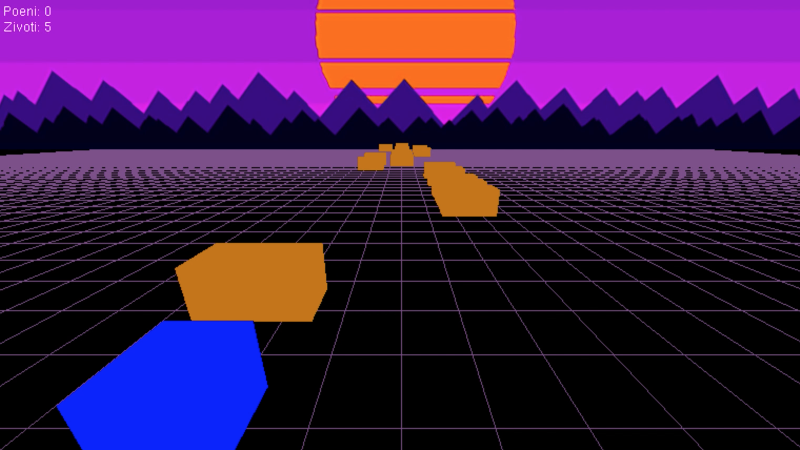

# BlockRacer

BlockRacer je igra inspirisana igrom AudioSurf.

Igrač kontroliše vozilo i skuplja blokove koji se kreću ka njemu. Cilj je skupiti što više blokova do kraja igre. U određenim intervalima se ubrzava kretanje blokova. Igra se završava kada igrač promaši 5 blokova.

| Komanda               | Taster                      |
| --------------------- |:---------------------------:|
| Levo                  | <kbd>A</kbd> <kbd>←</kbd>  |
| Desno                 | <kbd>D</kbd> <kbd>→</kbd>  |
| Izlaz iz igre         | <kbd>esc</kbd>              |
